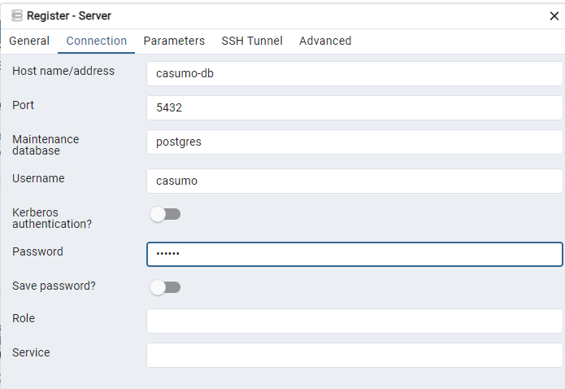

You may use this skeleton as a starting point for your solution. It contains a simple
Spring Boot web application written using Java 17 and built using Gradle.

## Requirements

You need to have Java JDK 17 installed on your machine and available on your path.

## Instructions

The application is built using Gradle, via the included wrapper (`gradlew`).

- To build the application, use `gradlew clean build`
> Use ```gradlew clean build --info``` when adding or testing new builds
- Any tests that you add under the ``src/test`` folder can be run using `gradlew clean test`
> Example: [SampleTest](src/test/java/com/casumo/videorental/SampleTest.java)
- To preview the tests directly, run ``gradlew clean testPreview``
> See ``task testPreview`` in [build.gradle](build.gradle) for more info
- To run the application, use `gradlew bootRun`
> - The application uses Docker and PostgreSQL to store data.
> - Make sure the containers are running before calling ``gradlew bootRun``
> > Run ``docker compose -f .docker/compose.yml -p casumo up -d``
> - You can access the database on http://localhost:5050 via PGAdmin
> >  PGAdmin credentials
> > - email: default@casumo.com
> > - pass: casumo
> > - Add the database to read data. 
> > - Check values in the [compose file](.docker/compose.yml) 


## API

- Provided [Postman Collection](.docker/Casumo.postman_collection.json) for working with the API.
- The main REST logic is located in the [Video Controller](src/main/java/com/casumo/videorental/api/controllers/VideoController.java)
> 1. GET http://localhost:8080/.rest/api/v1/videos - returns all videos in database 
> 2. GET http://localhost:8080/.rest/api/v1/videos/{id} - returns video with specific {id}
> 3. POST http://localhost:8080/.rest/api/v1/videos - post a single video
> 4. POST http://localhost:8080/.rest/api/v1/videos/multiple - post a list of videos
> 5. POST http://localhost:8080/.rest/api/v1/videos/rental
> > - This endpoint calculates the rental logic for a list of videos.
> > - When sending multiple videos, it calculates the sum.
> > - Calculating the surchages can be achieved by sending overdue days instead of initial days.